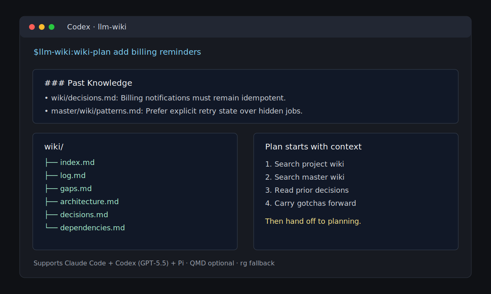

# llm-wiki

Bootstrap and query LLM-maintained project wikis before planning or implementation.

**Supports Claude Code + Codex (GPT-5.5) + Pi.**



`llm-wiki` turns the LLM Wiki pattern into installable agent skills. It is based on the setup from [How I Built a Self-Maintaining Knowledge Base for 6 Projects Using Claude Code & Karpathy's LLM Wiki](https://hackernoon.com/how-i-built-a-self-maintaining-knowledge-base-for-6-projects-using-claude-code-and-karpathys-llm-wiki).

It works with my original six-project setup: project-local `wiki/` folders, a main cross-project wiki at `~/wikis/master/wiki/`, `~/wikis/main/wiki/`, or a parent-directory `wikis/` folder, QMD semantic search when available, and ripgrep fallback when it is not.

`llm-wiki` packages four workflows:

- `bootstrap` creates a grounded `wiki/` knowledge base for the current project.
- `research` searches the project wiki and main cross-project wiki before planning or implementation.
- `wiki-plan` runs wiki research first, then hands the result to Compound Engineering planning when available.
- `status` checks whether a newer `llm-wiki` release is available and reports the correct update command.

## Install: Claude Code

Add the central marketplace:

```text
/plugin marketplace add ivankuznetsov/agent-plugins
```

Install this plugin:

```text
/plugin install llm-wiki@aikuznetsov-marketplace
```

Then use the installed plugin commands/skills from Claude Code. The key entrypoints are:

```text
/llm-wiki:bootstrap
/llm-wiki:research
/llm-wiki:wiki-plan
/llm-wiki:status
```

## Install: Codex

Register the marketplace:

```bash
codex plugin marketplace add ivankuznetsov/agent-plugins
```

Then open Codex, run `/plugins`, select the `aikuznetsov-marketplace` marketplace, and install `llm-wiki`.

After restarting Codex, invoke the skills using the namespace shown by `/skills`. The expected form is:

```text
$llm-wiki:bootstrap
$llm-wiki:research
$llm-wiki:wiki-plan
$llm-wiki:status
```

If Codex displays a fully qualified marketplace namespace, use that displayed name.

## Install: Pi

Install the Pi package from GitHub:

```bash
pi install git:github.com/ivankuznetsov/llm-wiki
```

Then invoke the Pi skills with prefixed names to avoid collisions with other Pi packages:

```text
/skill:wiki-bootstrap
/skill:wiki-research
/skill:wiki-plan
/skill:wiki-status
```

For local development from this checkout, run this from the target project:

```bash
pi install /path/to/llm-wiki -l
```

## Usage Examples

Bootstrap a wiki in the current project:

```text
$llm-wiki:bootstrap
```

Research past project knowledge before coding:

```text
$llm-wiki:research auth flow refactor
```

Plan with wiki context first:

```text
$llm-wiki:wiki-plan add billing reminders
```

Check whether `llm-wiki` has an update:

```text
$llm-wiki:status
```

Pi uses the same workflows through `/skill:wiki-*` commands:

```text
/skill:wiki-bootstrap
/skill:wiki-research auth flow refactor
/skill:wiki-plan add billing reminders
/skill:wiki-status
```

## Main Cross-Project Wiki

When present, `llm-wiki` searches a main cross-project wiki before creating or updating project wiki pages. It checks:

- `~/wikis/master/wiki/`
- `~/wikis/main/wiki/`
- `<parent-of-project>/wikis/master/wiki/`
- `<parent-of-project>/wikis/main/wiki/`

`<parent-of-project>` means the parent directory of the current repository root. If no main wiki exists during `bootstrap`, the agent asks whether to use a folder you provide or create a new master wiki at `<parent-of-project>/wikis/master/wiki/`.

## Automation

`bootstrap` installs wiki context for Claude Code, Codex, and Pi, regardless of which agent runs setup.

- Claude Code receives wiki context through `CLAUDE.md` and a Claude `SessionStart` context hook when available.
- Codex receives wiki context through `AGENTS.md`.
- Pi receives wiki context through `AGENTS.md`.
- Agent instruction updates are bounded by `<!-- BEGIN LLM WIKI -->` and `<!-- END LLM WIKI -->` markers so existing project instructions are preserved.
- Re-running `bootstrap` from another agent updates that agent's context without changing the headless maintenance owner.
- Existing projects from older `llm-wiki` versions keep their inferred headless owner when upgraded, even before `.llm-wiki/config.json` exists.

Only one agent owns scheduled refresh automation and post-commit wiki maintenance. The first agent to run `bootstrap` becomes the default headless maintainer, recorded in `.llm-wiki/config.json`.

- Claude Code headless automation uses `claude -p ...`
- Codex headless automation uses `codex exec -C <project-root> ...`
- Pi headless automation uses `pi -p --no-session --tools read,bash,edit,write,grep,find,ls ...`
- All automation paths search the project wiki and any detected main cross-project wiki.
- Scheduler and post-commit entries use managed markers and stable project slugs so repeated bootstraps do not create duplicate refresh jobs.

## Update Status

Check whether `llm-wiki` has a newer marketplace or Pi package release:

Claude Code:

```text
/llm-wiki:status
```

Codex:

```text
$llm-wiki:status
```

Pi:

```text
/skill:wiki-status
```

`status` reports the current cached or installed version, latest marketplace or Pi package version, whether an update is available, the update command, and whether a restart is required. When run inside a bootstrapped project, it also reports the configured headless agent and whether Claude/Codex/Pi wiki context is present.

## What It Creates

The bootstrap workflow creates a project-local knowledge base:

```text
wiki/
  index.md          # catalog of pages
  log.md            # append-only wiki changelog
  gaps.md           # open questions and missing coverage
  architecture.md   # high-level system structure
  decisions.md      # lightweight ADRs
  dependencies.md   # important dependency choices
raw/
  notes/            # manually added source material
```

It adapts page names to the project. A Rails app might get models/controllers/services pages; a frontend app might get components/hooks/stores pages; a CLI might get commands/modules pages.

## How `wiki-plan` Works

`wiki-plan` always does wiki research before planning:

1. Search the current project's wiki.
2. Search the main cross-project wiki when present.
3. Read relevant decisions, patterns, gaps, and gotchas.
4. Produce a `Past Knowledge` section.
5. Delegate to Compound Engineering planning when installed, or produce a standalone plan outline.

This keeps plans grounded in what already happened instead of rediscovering the codebase from scratch.

## QMD

QMD is preferred for semantic and lexical search, but it is optional. During bootstrap, `llm-wiki` checks for `qmd`; if it is missing, it suggests installing it with `npm install -g @tobilu/qmd` or `bun install -g @tobilu/qmd`, then lets you either install QMD or continue with the `rg` fallback. The workflows fall back to the `qmd` CLI when MCP tools are unavailable, and then to `rg` over `wiki/`, detected main wiki paths, and any user-provided main wiki folder when QMD is unavailable.

## Compound Engineering

`wiki-plan` delegates to Compound Engineering planning when the `compound-engineering:ce-plan` skill is installed. Without Compound Engineering, it still produces the Past Knowledge section and continues with a standalone implementation planning outline.

## Limits

- `llm-wiki` does not invent documentation. It reads source files and records uncertainty in `wiki/gaps.md`.
- QMD is optional, but semantic search is better when QMD is installed and indexed.
- Agent hooks differ between Claude Code, Codex, and Pi. `bootstrap` installs context for all supported agents, but only the configured `headless_agent` runs scheduled and post-commit maintenance.
- The first bootstrap pass is intentionally broad. Review `wiki/gaps.md` afterward to decide what deserves deeper documentation.
