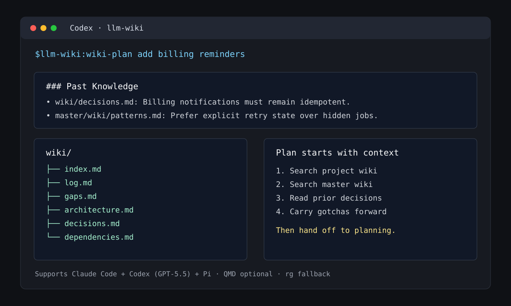

# llm-wiki

Bootstrap, upgrade, and query LLM-maintained project wikis before planning or implementation.

**Supports Claude Code + Codex + Pi + OpenClaw.**



`llm-wiki` turns the LLM Wiki pattern into installable agent skills. It is based on the setup from [How I Built a Self-Maintaining Knowledge Base for 6 Projects Using Claude Code & Karpathy's LLM Wiki](https://hackernoon.com/how-i-built-a-self-maintaining-knowledge-base-for-6-projects-using-claude-code-and-karpathys-llm-wiki).

It works with my original six-project setup: project-local `wiki/` folders, a main cross-project wiki at `~/wikis/master/wiki/`, `~/wikis/main/wiki/`, or a parent-directory `wikis/` folder, QMD semantic search when available, and ripgrep fallback when it is not.

`llm-wiki` packages five workflows:

- `bootstrap` creates a grounded `wiki/` knowledge base for the current project.
- `upgrade` migrates an existing project's managed scripts, hook, and changelog structure.
- `research` searches the project wiki and main cross-project wiki before planning or implementation.
- `wiki-plan` runs wiki research first, then hands the result to Compound Engineering planning when available.
- `status` checks whether a newer `llm-wiki` release is available and reports the correct update command.

## Install: Claude Code

Add the central marketplace:

```text
/plugin marketplace add ivankuznetsov/agent-plugins
```

Install this plugin:

```text
/plugin install llm-wiki@aikuznetsov-marketplace
```

Then use the installed plugin commands/skills from Claude Code. The key entrypoints are:

```text
/llm-wiki:bootstrap
/llm-wiki:upgrade
/llm-wiki:research
/llm-wiki:wiki-plan
/llm-wiki:status
```

## Install: Codex

Register the marketplace:

```bash
codex plugin marketplace add ivankuznetsov/agent-plugins
```

Then open Codex, run `/plugins`, select the `aikuznetsov-marketplace` marketplace, and install `llm-wiki`.

After restarting Codex, invoke the skills using the namespace shown by `/skills`. The expected form is:

```text
$llm-wiki:bootstrap
$llm-wiki:upgrade
$llm-wiki:research
$llm-wiki:wiki-plan
$llm-wiki:status
```

If Codex displays a fully qualified marketplace namespace, use that displayed name.

## Install: Pi

Install the self-contained package directory from this marketplace clone:

```bash
pi install /path/to/agent-plugins/plugins/llm-wiki
```

Then invoke the Pi skills with prefixed names to avoid collisions with other Pi packages:

```text
/skill:wiki-bootstrap
/skill:wiki-upgrade
/skill:wiki-research
/skill:wiki-plan
/skill:wiki-status
```

For linked local development from the standalone upstream checkout, run this
from the target project:

```bash
pi install /path/to/llm-wiki -l
```

## Install: OpenClaw

Install the self-contained package directory from this marketplace clone:

```bash
openclaw plugins install /path/to/agent-plugins/plugins/llm-wiki
```

OpenClaw exposes the collision-safe `wiki-bootstrap`, `wiki-upgrade`,
`wiki-research`, `wiki-plan`, and `wiki-status` skill names.

## Usage Examples

Bootstrap a wiki in the current project:

```text
$llm-wiki:bootstrap
```

Upgrade an already bootstrapped project's managed structure after installing a
new `llm-wiki` release:

```text
$llm-wiki:upgrade
```

Updating the plugin or Pi package does not rewrite project-local `.llm-wiki`
files automatically. Restart the agent after updating the package, then run the
upgrade command once in each existing project. The migration preserves the
configured headless owner and unrelated dirty work; if a legacy project has no
config, it creates one only when exactly one owner can be inferred from live
scripts or Git history. It does not regenerate wiki content or invoke an LLM.

Research past project knowledge before coding:

```text
$llm-wiki:research auth flow refactor
```

Plan with wiki context first:

```text
$llm-wiki:wiki-plan add billing reminders
```

Check whether `llm-wiki` has an update:

```text
$llm-wiki:status
```

Pi uses the same workflows through `/skill:wiki-*` commands:

```text
/skill:wiki-bootstrap
/skill:wiki-upgrade
/skill:wiki-research auth flow refactor
/skill:wiki-plan add billing reminders
/skill:wiki-status
```

## Main Cross-Project Wiki

When present, `llm-wiki` searches a main cross-project wiki before creating or updating project wiki pages. It checks:

- `~/wikis/master/wiki/`
- `~/wikis/main/wiki/`
- `<parent-of-project>/wikis/master/wiki/`
- `<parent-of-project>/wikis/main/wiki/`

`<parent-of-project>` means the parent directory of the current repository root. If no main wiki exists during `bootstrap`, the agent asks whether to use a folder you provide or create a new master wiki at `<parent-of-project>/wikis/master/wiki/`.

## Automation

`bootstrap` installs project wiki context through the instruction surfaces used
by Claude Code, Codex, Pi, and OpenClaw.

- Claude Code receives wiki context through `CLAUDE.md` and a Claude `SessionStart` context hook when available.
- Codex receives wiki context through `AGENTS.md`.
- Pi receives wiki context through `AGENTS.md`.
- OpenClaw receives wiki context through the `AGENTS.md` in its configured agent workspace.
- Agent instruction updates are bounded by `<!-- BEGIN LLM WIKI -->` and `<!-- END LLM WIKI -->` markers so existing project instructions are preserved.
- Re-running `bootstrap` from another agent updates that agent's context without changing the headless maintenance owner.
- Existing projects from older `llm-wiki` versions keep their inferred headless
  owner when upgraded, even when `.llm-wiki/config.json` survives only in Git
  history.

Only one agent owns scheduled refresh automation and post-commit wiki maintenance. The first agent to run `bootstrap` becomes the default headless maintainer, recorded in `.llm-wiki/config.json`.

- Claude Code headless automation uses `claude -p ...`
- Codex headless automation uses `codex exec -C <project-root> ...`
- Pi headless automation uses `pi -p --no-session --tools read,bash,edit,write,grep,find,ls ...`
- OpenClaw headless automation uses `openclaw agent --local --agent <openclaw_agent_id> --message ... --json --timeout 1800` without delivery, channel, reply, or recipient flags. Bootstrap records the agent whose configured workspace matches the project instead of guessing a default ID.
- All automation paths search the project wiki and any detected main cross-project wiki.
- Scheduler and post-commit entries use managed markers and stable project slugs so repeated bootstraps do not create duplicate refresh jobs.
- Post-commit maintenance never writes into a user checkout. Relevant commits
  are coalesced in the shared Git directory and refreshed transactionally on the
  local `llm-wiki/refresh` branch through a disposable managed worktree. A
  canonical runner in that shared Git directory serves every linked worktree,
  with one canonical owner config, so upgrading once cannot leave older branches
  executing stale local scripts or selecting a stale provider.
  A project-local ignored wiki seeds that branch only when it has no established
  wiki of its own. Failed refreshes discard generated work. After two consecutive
  failed batches by default, a repository-wide circuit stops provider launches;
  later commits continue queueing and failed records remain under
  `llm-wiki/failed/`. A queue above 25 sources also opens the circuit before a
  provider starts. Each worker runs at most one batch of 10 sources, with
  bounded changed-path context, so concurrent hooks cannot turn a historical
  backlog into an unbounded sequence of subscription runs. Override these
  defaults with `LLM_WIKI_MAX_AUTO_PENDING`, `LLM_WIKI_MAX_BATCH_SOURCES`,
  `LLM_WIKI_MAX_PATHS_PER_SOURCE`, and `LLM_WIKI_MAX_PATH_BYTES`.
  Queued commits are pinned under `refs/llm-wiki/sources/` until their durable
  receipt is written. Sources that arrive outside a running batch open a visible
  `deferred:<count>` circuit rather than remaining silently pending.
  Atomic source-SHA receipt refs make changed and no-op acknowledgement replay-safe, and
  a compare-and-swap Git ref makes stale-lock replacement single-winner.
- Agent and QMD execution is always time-bounded. The post-commit worker uses
  `timeout` (Linux) or `gtimeout` (macOS via GNU coreutils); when neither is
  installed it fails before starting a provider. A 10-second forced-kill grace
  period follows the first timeout signal; set `LLM_WIKI_TIMEOUT_KILL_AFTER` to
  another positive number of seconds when needed. Set
  `LLM_WIKI_MAX_REFRESH_ATTEMPTS` to a positive integer to change the automatic
  retry bound.
- After fixing a failed provider or validation issue, run
  `.llm-wiki/post-commit-refresh.sh --retry-failed all` to restore quarantined
  records and explicitly retry one bounded queue batch. Rerun it until no queued
  sources remain; only the final successful batch clears the circuit. A failed
  retry leaves it open. Pass a full source SHA instead of `all` to restore one
  quarantined record.
- The refresh branch is intentionally local and is never pushed automatically;
  operators can inspect, merge, or open a PR from it on their normal schedule.

## Update Status

Check whether `llm-wiki` has a newer marketplace or Pi package release:

Claude Code:

```text
/llm-wiki:status
```

Codex:

```text
$llm-wiki:status
```

Pi:

```text
/skill:wiki-status
```

OpenClaw:

```text
wiki-status
```

`status` reports the current cached or installed version, latest marketplace or package version, whether an update is available, the update command, and whether a restart is required. For OpenClaw, it checks `openclaw plugins list/inspect`, dry-runs `openclaw plugins update llm-wiki`, and uses `openclaw gateway restart --safe` when a running Gateway must reload the update. When run inside a bootstrapped project, it also reports the configured headless agent and whether Claude/Codex/Pi/OpenClaw wiki context is present.

## What It Creates

The bootstrap workflow creates a project-local knowledge base:

```text
wiki/
  index.md          # catalog of pages
  log.md            # append-only wiki changelog
  gaps.md           # open questions and missing coverage
  architecture.md   # high-level system structure
  decisions.md      # lightweight ADRs
  dependencies.md   # important dependency choices
raw/
  notes/            # manually added source material
```

It adapts page names to the project. A Rails app might get models/controllers/services pages; a frontend app might get components/hooks/stores pages; a CLI might get commands/modules pages.

## How `wiki-plan` Works

`wiki-plan` always does wiki research before planning:

1. Search the current project's wiki.
2. Search the main cross-project wiki when present.
3. Read relevant decisions, patterns, gaps, and gotchas.
4. Produce a `Past Knowledge` section.
5. Delegate to Compound Engineering planning when installed, or produce a standalone plan outline.

This keeps plans grounded in what already happened instead of rediscovering the codebase from scratch.

## QMD

QMD is preferred for semantic and lexical search, but it is optional. During bootstrap, `llm-wiki` checks for `qmd`; if it is missing, it suggests installing it with `npm install -g @tobilu/qmd` or `bun install -g @tobilu/qmd`, then lets you either install QMD or continue with the `rg` fallback. The workflows fall back to the `qmd` CLI when MCP tools are unavailable, and then to `rg` over `wiki/`, detected main wiki paths, and any user-provided main wiki folder when QMD is unavailable.

## Compound Engineering

`wiki-plan` delegates to Compound Engineering planning when the `compound-engineering:ce-plan` skill is installed. Without Compound Engineering, it still produces the Past Knowledge section and continues with a standalone implementation planning outline.

## Limits

- `llm-wiki` does not invent documentation. It reads source files and records uncertainty in `wiki/gaps.md`.
- QMD is optional, but semantic search is better when QMD is installed and indexed.
- Agent hooks differ between Claude Code, Codex, Pi, and OpenClaw. `bootstrap` installs context for all supported agents, but only the configured `headless_agent` runs scheduled and post-commit maintenance.
- The first bootstrap pass is intentionally broad. Review `wiki/gaps.md` afterward to decide what deserves deeper documentation.
